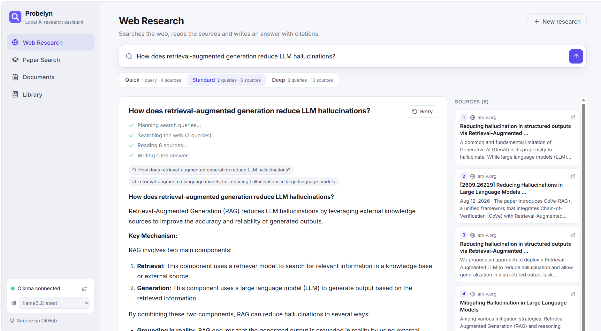
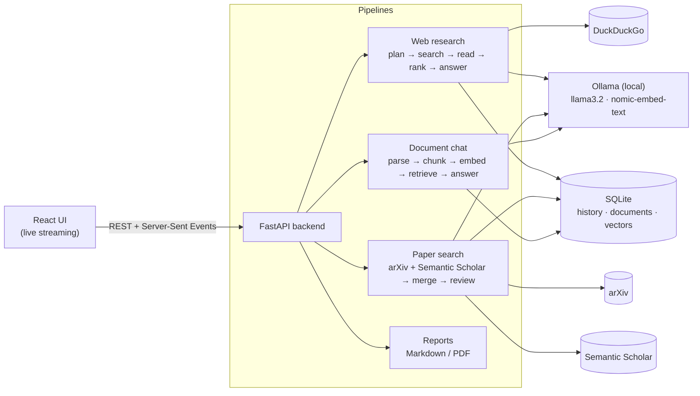

<div align="center">

# 🔍 Probelyn

### A private AI research assistant that runs on your own computer

Ask a question and Probelyn searches the web and academic papers, reads the sources, and writes an answer **with citations you can click and check**. You can also chat with your own PDFs.
Everything runs locally with [Ollama](https://ollama.com). There are no API keys, no subscriptions, and your data stays on your machine.

[](https://github.com/Zeeshan409-coder/ai-research-assistant-probelyn/actions/workflows/ci.yml)


-000000)




<sub>Web Research: the model plans search queries, reads 6 sources, and writes an answer where every claim links to its source.</sub>

</div>

---

## 📚 Contents

- [Features](#-features)
- [Quick start](#-quick-start)
- [How it works](#-how-it-works)
- [Configuration](#%EF%B8%8F-configuration)
- [API](#-api)
- [Project structure](#%EF%B8%8F-project-structure)
- [Testing](#-testing)
- [Design decisions](#-design-decisions)
- [Roadmap](#%EF%B8%8F-roadmap)

---

## ✨ Features

| | Feature | What it does |
|---|---|---|
| 🌐 | **Web research with citations** | Turns your question into several search queries, reads the top pages, picks the most relevant passages, and writes an answer where every claim is cited `[1]`, `[2]` and so on. Click a citation to jump to its source. |
| 🎓 | **Academic paper search** | Searches **arXiv** and **Semantic Scholar** together, removes duplicates, and lets you filter by year or sort by relevance, citations or date. It writes a **literature overview**, and every paper has a one-click summary (TL;DR, method, results, limitations). |
| 📄 | **Chat with your documents** | Upload PDF, TXT or Markdown files, or import an open-access paper straight from search. Answers cite the **exact document and page number**. |
| 📑 | **Library and reports** | Every question is saved automatically. Combine any answers into one **Markdown or PDF report**, or delete single entries, several at once, or everything. |
| ⚡ | **Live streaming** | Watch each step happen (planning, searching, reading, writing) with the answer streaming in word by word. |
| ⏹ | **Stop anytime** | **Stop** halts the model immediately and keeps the partial answer. **New research** lets the current answer finish in the background and saves it to the Library. |
| 🔒 | **Private by design** | The language model and embeddings run locally. Only your search queries go to the internet. |

---

## 🚀 Quick start

### 1. Install the requirements

| Tool | Version | Download |
|---|---|---|
| Ollama | latest | https://ollama.com/download |
| Python | 3.11 or newer | https://www.python.org/downloads/ |
| Node.js | 18 or newer | https://nodejs.org/ |

> 💡 About 8 GB of RAM is enough for the default model (`llama3.2`, 3B). With 16 GB or more, try `qwen2.5:7b` for better answers.

### 2. Download the code

```bash
git clone https://github.com/Zeeshan409-coder/ai-research-assistant-probelyn.git
cd ai-research-assistant-probelyn
```

### 3. Run it

**Windows:** double-click **`start.bat`**
**macOS / Linux:** run `./start.sh`

The first run takes a few minutes. It downloads the AI models (about 2.3 GB), installs everything, and opens **http://localhost:8000** in your browser. Later starts only take a few seconds.

When you see a green **"Ollama connected"** dot in the bottom-left corner, you're ready.

<details>
<summary><b>Other ways to run it (Docker, or development mode)</b></summary>

#### Docker

```bash
docker compose up --build
# the first run downloads the models, follow along with:
docker compose logs -f ollama-pull
```
Then open http://localhost:8000.

#### Development mode (hot reload)

```bash
# models
ollama pull llama3.2
ollama pull nomic-embed-text

# backend → http://localhost:8000/docs (interactive API docs)
cd backend
python -m venv .venv
.venv\Scripts\activate            # macOS/Linux: source .venv/bin/activate
pip install -r requirements-dev.txt
uvicorn app.main:app --reload

# frontend (second terminal) → http://localhost:5173
cd frontend
npm install
npm run dev
```

**No GPU or no Ollama yet?** Run `python scripts/mock_ollama.py` inside `backend/`. It starts a fake model server that returns placeholder answers, which is handy for working on the UI.

</details>

---

## 🧠 How it works



**Web research**
1. **Plan:** the model rewrites your question into 1–3 different search queries, depending on the depth you choose (Quick, Standard or Deep).
2. **Search:** the queries run in parallel, and duplicate results are removed.
3. **Read:** the pages are downloaded and cleaned. Menus, ads and scripts are stripped out.
4. **Rank:** a built-in **BM25** ranker keeps only the most relevant passages from each page. This keeps the prompt small enough for local models.
5. **Answer:** the model writes an answer using only those numbered sources and cites each claim.

**Document chat (RAG)**
- PDFs are split into overlapping chunks of about 1,000 characters. Each chunk keeps its page number.
- The chunks are embedded locally with `nomic-embed-text` and stored in SQLite, so no separate vector database is needed.
- **Hybrid retrieval** combines meaning-based search (embeddings) with keyword search (BM25). This catches both paraphrases and exact terms such as names, acronyms and formulas.
- The last few messages of the chat go to the model, so follow-up questions work.

**Background runs and Stop**
Each research run is a background task that saves itself to the Library as it goes. If you close the tab or click **New research**, the answer still finishes and is saved. **Stop** cancels the task, which closes the connection to Ollama and halts generation immediately. The partial answer is kept and marked *Stopped*.

---

## ⚙️ Configuration

Copy `backend/.env.example` to `backend/.env` and change any of these. Every setting is optional.

| Setting | Default | What it does |
|---|---|---|
| `PROBELYN_OLLAMA_URL` | `http://localhost:11434` | Where Ollama is running |
| `PROBELYN_CHAT_MODEL` | `llama3.2` | Default chat model (you can also switch models in the sidebar) |
| `PROBELYN_EMBED_MODEL` | `nomic-embed-text` | Model used to index your documents |
| `PROBELYN_TOP_K` | `6` | How many document chunks each answer uses |
| `PROBELYN_CHUNK_SIZE` / `_OVERLAP` | `1000` / `200` | How documents are split |
| `PROBELYN_SEMANTIC_SCHOLAR_API_KEY` | – | Optional free key for higher paper-search limits |
| `PROBELYN_DATA_DIR` | `data` | Where your history and uploads are stored |

**Using a different model:** run `ollama pull qwen2.5:7b` (or `llama3.1:8b`, `mistral` and so on). It then appears in the model dropdown in the sidebar.

---

## 📡 API

Interactive docs are at **http://localhost:8000/docs**. The streaming endpoints (🔴) send these Server-Sent Events: `entry`, `status`, `queries`, `sources`, `papers`, `token`, `done`, `stopped` and `error`.

| Method | Endpoint | Description |
|---|---|---|
| `GET` | `/api/health` | Ollama status and installed models |
| `POST` | `/api/research/web` | 🔴 Web research `{question, depth}` |
| `POST` | `/api/papers/research` | 🔴 Paper search and literature overview |
| `POST` | `/api/papers/search` | Paper search only (JSON) |
| `POST` | `/api/papers/summarize` | 🔴 Summary of one paper |
| `POST` | `/api/papers/import` | Add an open-access PDF to your documents |
| `GET` · `POST` · `DELETE` | `/api/documents` | List, upload or delete documents |
| `POST` | `/api/documents/ask` | 🔴 Ask a question about selected documents |
| `POST` | `/api/runs/{id}/stop` | Stop a run that's still generating |
| `GET` | `/api/history` | All saved entries |
| `DELETE` | `/api/history/{id}` | Delete one entry |
| `POST` | `/api/history/delete` | Delete several entries `{entry_ids}` |
| `DELETE` | `/api/history?confirm=true` | Clear the whole history |
| `POST` | `/api/export` | Download a report `{entry_ids, format: "md" \| "pdf", title}` |

---

## 🗂️ Project structure

```
probelyn/
├── backend/                    Python · FastAPI
│   ├── app/
│   │   ├── main.py             app setup, serves the built frontend
│   │   ├── routers.py          all HTTP endpoints
│   │   ├── llm.py              async Ollama client (streaming chat + embeddings)
│   │   ├── db.py               SQLite: history, documents, vectors
│   │   ├── sse.py              background runs, streaming, Stop
│   │   ├── config.py           settings from environment variables
│   │   └── services/
│   │       ├── web_search.py   web research pipeline
│   │       ├── papers.py       arXiv + Semantic Scholar
│   │       ├── documents.py    PDF parsing, chunking, hybrid retrieval
│   │       ├── text.py         chunker + BM25 ranker
│   │       ├── recording.py    saves every run to the Library
│   │       ├── export.py       Markdown and PDF reports
│   │       └── prompts.py      all prompts in one place
│   ├── tests/                  pytest suite (runs offline with a fake LLM)
│   └── scripts/mock_ollama.py  fake Ollama for UI development
├── frontend/                   React · Vite
│   └── src/
│       ├── views/              Web Research, Papers, Documents, Library
│       ├── components/         Markdown with citations, sources, export
│       ├── hooks/              useResearchStream (streaming state)
│       └── api.js              fetch + stream reader
├── docs/screenshots/
├── start.bat · start.sh        one-click start
├── Dockerfile · docker-compose.yml
└── .github/workflows/ci.yml    lint, test and build on every push
```

---

## 🧪 Testing

```bash
cd backend
pytest -q       # 21 tests, run offline in about 1 second
ruff check .
```

The tests replace Ollama with a small **fake model** and fake the network, so the real pipelines run end to end in CI. They cover streaming, de-duplicating sources, parsing arXiv results, uploading a PDF and retrieving the right page, Markdown/PDF export, deleting history, **saving an answer when you navigate away**, and **Stop halting generation**.

---

## 💡 Design decisions

- **Local models instead of paid APIs.** There are no running costs, and your data stays private. Small models write weaker answers, so the pipelines keep prompts short and focused (BM25 passage selection, top-k chunks) and use strict citation rules.
- **SQLite + NumPy instead of a vector database.** For a personal library of thousands of chunks, comparing every chunk takes milliseconds. This removes a whole service from the setup.
- **Server-Sent Events instead of WebSockets.** Research only streams one way, from server to browser, so SSE is simpler and works over plain HTTP.
- **No LangChain.** Every step is short, explicit code, which makes the system easy to read, test and explain.

## 🛣️ Roadmap

- [ ] OCR for scanned PDFs
- [ ] Export citations to BibTeX / RIS
- [ ] Multi-step "deep research" agent that checks its own answers
- [ ] Re-ranking with a cross-encoder
- [ ] Dark / light theme toggle

## ⚠️ Limitations

- Answer quality depends on the local model. 7B+ models are noticeably better than 3B.
- DuckDuckGo and Semantic Scholar limit heavy use. Add a free Semantic Scholar key if you hit limits.
- Some websites block automated reading. In that case the search snippet is used instead.

---

## 📄 License

[MIT](LICENSE) © [Zeeshan](https://github.com/Zeeshan409-coder). The bundled DejaVu fonts (used for PDF export) have their own free license, see `backend/app/assets/fonts/`.
